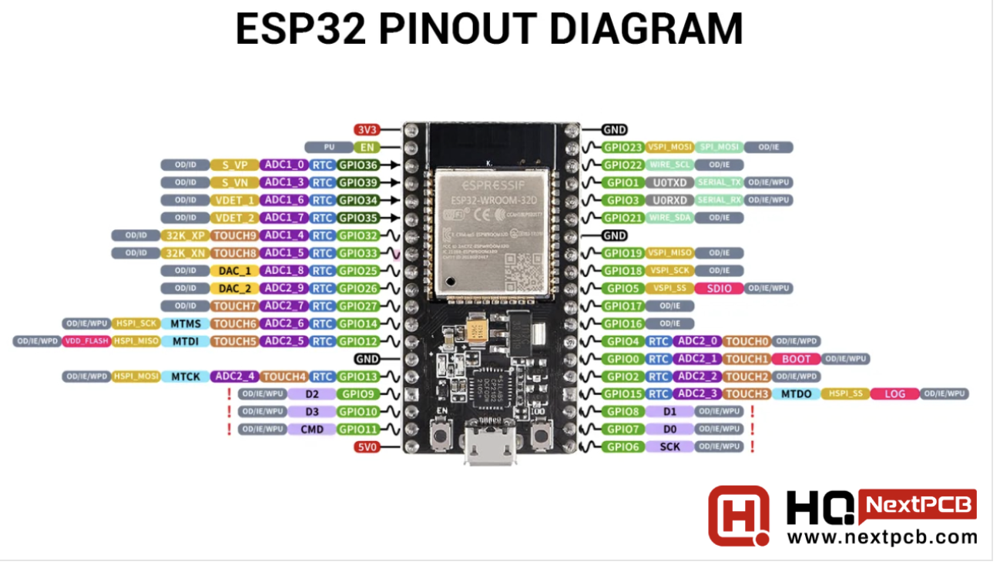
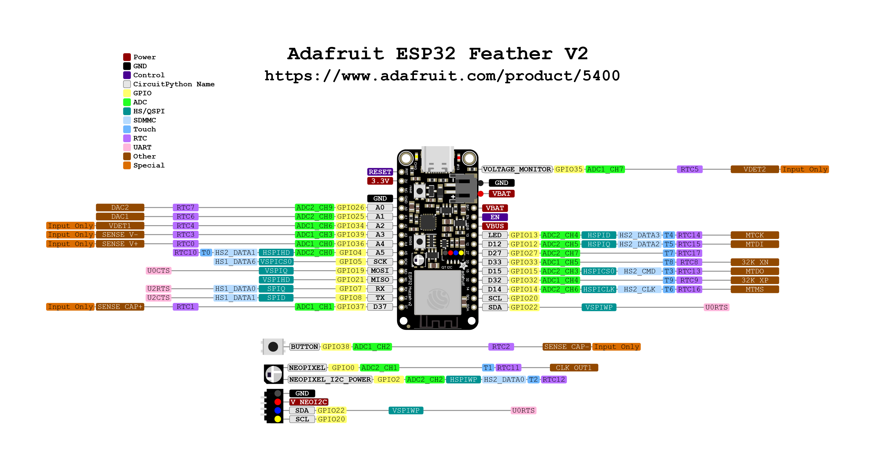

# ESP32 

## Description 
ESP32s are the microcontrollers that we would like to use in order to control our boats. They are usually dual 
core microcontrollers with wifi support and many different IO pins on them that support different peripherals. 
They are capable of running RTOS and multitasking which makes them great for applications that require different things 
running at once. Furthermore they are compatible with [Platform.io] and can use the Arduino core which makes them
very easy to program. 

There are many different kinds of ESPs, and their pinouts as well as general descriptions/logs of our usage are 
included below. 

## ESP-WROOM-32 

 

Please reference the image above for any pinouts you need to use from this board. It is powered by the 5v pin as we 
can see in the diagram above. To power from a battery connect the power and ground ports on the dev board and it should 
turn on.  

You might need to download some drivers in order for your computer to recognize this device. This uses a CP2102 for it’s
 UART communication, you can find the drivers for this [here](https://www.silabs.com/developers/usb-to-uart-bridge-vcp-drivers?tab=downloads).  

In the Arduino IDE or Platform.io this board is under the name “ESP32 Dev Board”

## Adafruit ESP32 Feather V2 



Please refer to the pinout above for the ESP32 feather module. 

By default, this module should be recognized by the Arduino IDE under the board type of “Adafruit Feather ESP32 V2”.

At the moment not much has been done with this board as I tend to default to the regular ESP32-WROOM-32 but maybe someone will update this (Alex)


## Troubleshooting 

Here are some issues you might run into while using an ESP32 

- Unable to locate COM port in device manager even though ESP32 is plugged in
    - Solution 1: Ensure that the cable you’re using is a data cable and not just a power cable.
      Some cables only have power (5v and GND) lines but no data lines (TX and RX)
    - Solution 2: It’s possible that you don’t have the correct driver installed. For example, for the ESP32-WROOM-32D, 
      you might need to install the CP2102 driver in order for your machine to recognize the ESP32. 
      Search up what chip is used on your board for UART communication.
- With the RadioHead library you might run into the issue of the code not compiling. The error message will probably look like the following
    
    ```arduino
    **```
    ~/Documents/Arduino/libraries/RadioHead-master/RH_ASK.cpp:528:23: error: too many arguments to 
      function 'hw_timer_t* timerBegin(uint32_t)'
      528 |     timer = timerBegin(0, 80, true); // Alarm value will be in in us
          |             ~~~~~~~~~~^~~~~~~~~~~~~
    In file included from ~/Library/Arduino15/packages/esp32/hardware/esp32/3.0.0-alpha3/cores/esp32/esp32-hal.h:84,
                     from ~/Library/Arduino15/packages/esp32/hardware/esp32/3.0.0-alpha3/cores/esp32/Arduino.h:36,
                     from ~/Documents/Arduino/libraries/RadioHead-master/RadioHead.h:1544,
                     from ~/Documents/Arduino/libraries/RadioHead-master/RHGenericDriver.h:9,
                     from ~/Documents/Arduino/libraries/RadioHead-master/RH_ASK.h:9,
                     from ~/Documents/Arduino/libraries/RadioHead-master/RH_ASK.cpp:6:
    ~/Library/Arduino15/packages/esp32/hardware/esp32/3.0.0-alpha3/cores/esp32/esp32-hal-timer.h:35:14: note: declared here
       35 | hw_timer_t * timerBegin(uint32_t frequency);
          |              ^~~~~~~~~~
    ~/Documents/Arduino/libraries/RadioHead-master/RH_ASK.cpp:529:25: error: too many arguments to function 
      'void timerAttachInterrupt(hw_timer_t*, void (*)())'
      529 |     timerAttachInterrupt(timer, &esp32_timer_interrupt_handler, true);
          |     ~~~~~~~~~~~~~~~~~~~~^~~~~~~~~~~~~~~~~~~~~~~~~~~~~~~~~~~~~~~~~~~~~
    ~/Library/Arduino15/packages/esp32/hardware/esp32/3.0.0-alpha3/cores/esp32/esp32-hal-timer.h:50:6: note: declared here
       50 | void timerAttachInterrupt(hw_timer_t * timer, void (*userFunc)(void));
          |      ^~~~~~~~~~~~~~~~~~~~
    ~/Documents/Arduino/libraries/RadioHead-master/RH_ASK.cpp:530:5: error: 'timerAlarmWrite' was not declared in 
      this scope; did you mean 'timerWrite'?
      530 |     timerAlarmWrite(timer, 1000000 / _speed / 8, true);
          |     ^~~~~~~~~~~~~~~
          |     timerWrite
    ~/Documents/Arduino/libraries/RadioHead-master/RH_ASK.cpp:531:5: error: 'timerAlarmEnable' was not declared in this scope;
      did you mean 'timerAlarm'?
      531 |     timerAlarmEnable(timer);
          |     ^~~~~~~~~~~~~~~~
          |     timerAlarm
    
    exit status 1
    
    Compilation error: exit status 1```
    ```**
    ```
    
    - Solution: This error occurs due to the fact that Espressif changed the Timer API. There is a fix that can be found on Github [here](https://github.com/adafruit/RadioHead/issues/79)


[Platform.io]: https://docs.platformio.org/en/latest/what-is-platformio.html